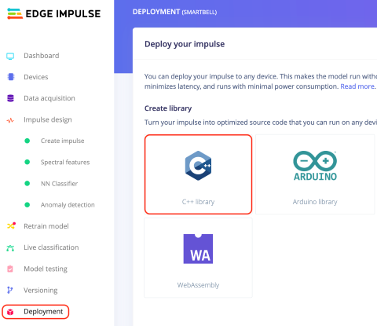
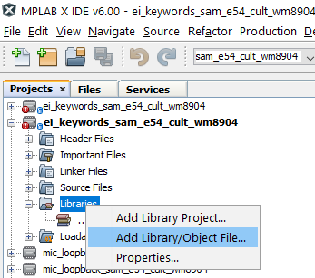
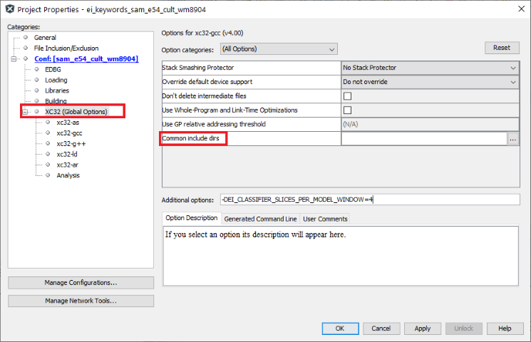
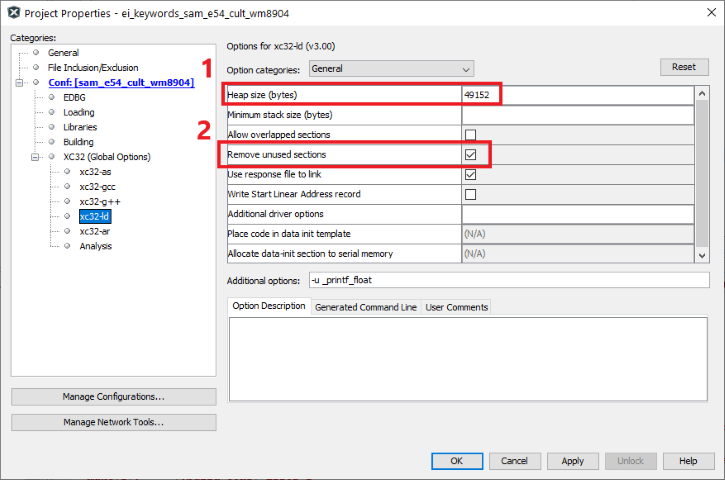

# Edge Impulse Project Builder
This repository contains instructions for creating a library object from an
[Edge Impulse Studio](https://edgeimpulse.com/product) project for any xc32
supported platform.

Notes:
- This script has only been tested under linux (ubuntu), [Git
  Bash](https://gitforwindows.org/), and macOS.
- `*.options.ini` can be modified to set additional project options; for help
  call the mplab script `prjMakefilesGenerator -setoptions=@ -help`
  + NB: all relative paths are considered relative to the project root folder
    (.X folder)
- `*.project.ini` is just a placeholder - the **languageToolchain** and
  **device** variables are replaced when building the project - others will take
  default values if unspecified.

## Software Used
* MPLAB® X IDE *>=6.00* (https://microchip.com/mplab/mplab-x-ide)

## Model Deployment
The first step in building an MPLAB project for Edge Impulse is of course to deploy the Edge Impulse model.

1. Open Edge Impulse Studio.

2. Click on the *Deployment* step in the sidebar menu.

3. Under *Create Library* select *C++ library*, then click *Build* to download
   the library.

   

## Edge Impulse SDK Build Instructions
The following steps cover compiling the Edge Impulse library into a static library object.

1. Extract the library from the step above directly into this folder.

2. (Optional) Open `options.ini` and modify C as needed.

3. Set the environment variables **PRJ_NAME** **DEVICE** **MPLAB_PATH**
   **XC_PATH** as desired, then run `build.sh` to generate the library object.
   For example:
   - `DEVICE=ATSAME54P20A PRJ_NAME=libedgeimpulse CMSIS_DSP=1 CMSIS_NN=1 ./build.sh`

## Integration Instructions
Below are instructions for integrating the library object, compiled with the
steps above, into an MPLAB X project.

1. Add the library object from the step above into an existing MPLAB project as
   shown below.

   

2. Add the `src/ei_porting.cpp` file from this repository to your project, this implements the required Edge Impulse stubs.

3. Use `src/main.cpp` as a template for integrating the Edge Impulse library
   into your project.

4. Add the path to the directory where the SDK is extracted in your include path
   under *Project Properties* -> *XC32 Global Options* -> *Common include dirs*

   

5. The Edge Impulse SDK uses dynamic memory allocation so allocate additional
   heap memory under *Project Properties* -> *xc32-ld* -> *Heap size* (see (1)
   in the image below). The number will vary based on your Edge Impulse project
   parameters (especially the maximum width of your neural network layers).

6. Ensure that the `Remove unused sections` option under *Project Properties* ->
   *xc32-ld* is enabled (see (2) in the image below); this will eliminate any
   unused data or functions from the SDK to reclaim device memory.

   

You should now have your Edge Impulse model fully integrated with an MPLAB X
project. In order to update the deployed model, simply repeat the steps from the
[build instructions](#edge-impulse-sdk-build-instructions) section above.

## Additional Notes
Some special care has to be taken to ensure the library is integrated correctly with your project:

- If the CMSIS libraries are included in the build, make sure your project
  doesn't link the pre-built CMSIS library optionally included with MPLAB
  Harmony projects.

- The Edge Impulse SDK will automatically determine whether to include the CMSIS
  NN/DSP libraries. You can use `EIDSP_USE_CMSIS_DSP=0` and
  `EI_CLASSIFIER_TFLITE_ENABLE_CMSIS_NN=0` to manually disable this behavior.
